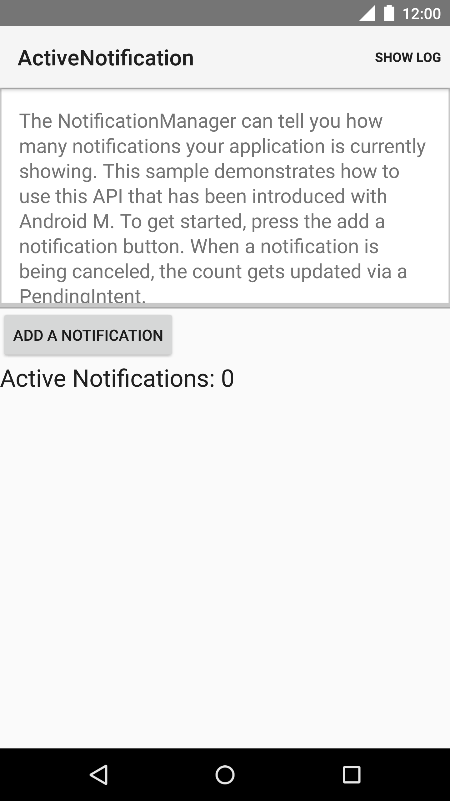
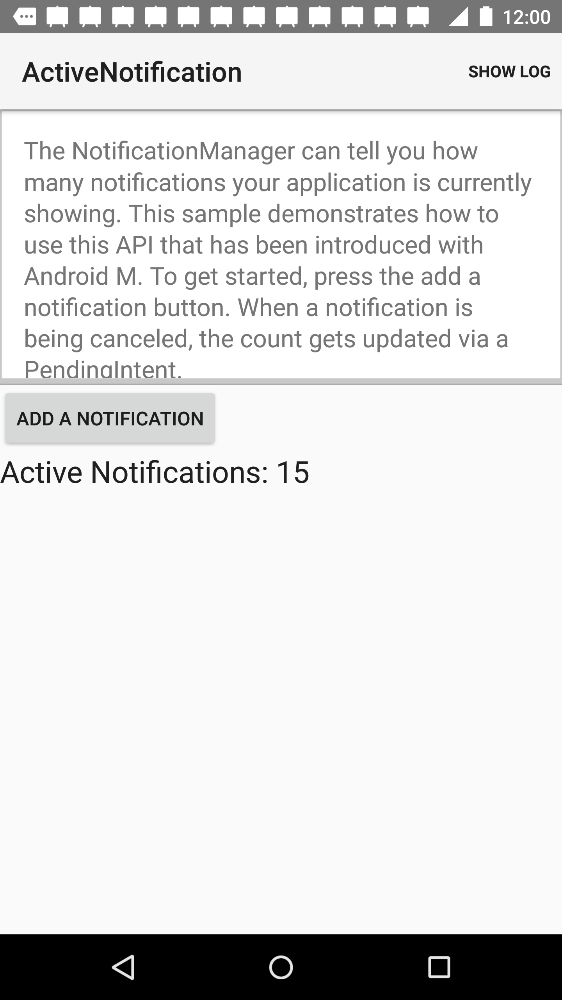
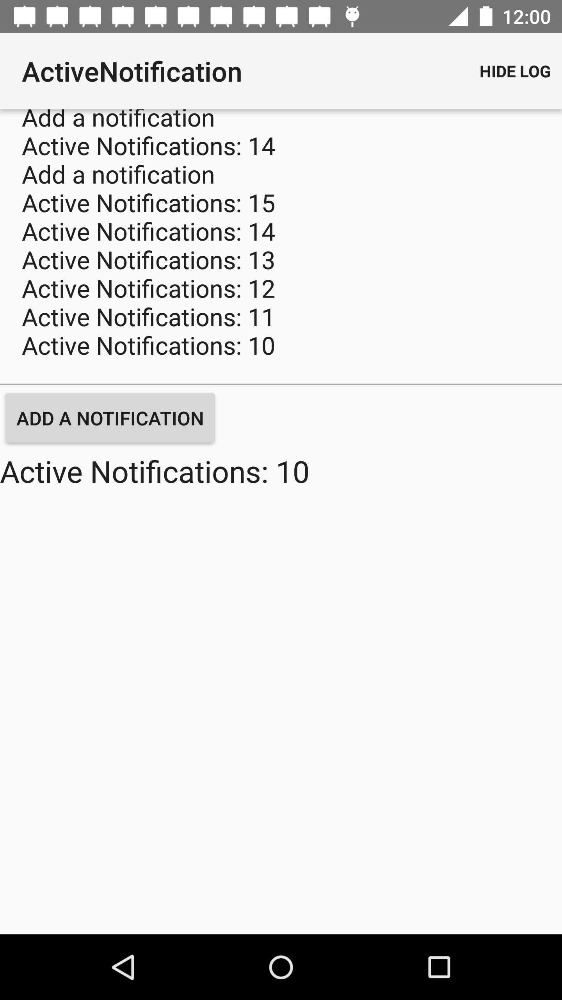

Android ActiveNotification Sample
===================================

The NotificationManager can tell you how many notifications your application is
            currently showing. This sample demonstrates how to use this API that has been
            introduced with Android M.

Introduction
------------

The [NotificationManager][1] has become more powerful.
            Starting with Android M, you can query it for the active notifications that
            your app sent using the [notify][2] methods.

            This sample demonstrates simple use of this newly added functionality by
            allowing a user to add notifications and then querying how many notifications
            are currently being displayed via the [getActiveNotifications()][3] method.

            [1]: https://developer.android.com/reference/android/app/NotificationManager.html
            [2]: https://developer.android.com/reference/android/app/NotificationManager.html#notify(int, android.app.Notification)
            [2]: https://developer.android.com/reference/android/app/NotificationManager.html#getActiveNotifications()

Pre-requisites
--------------

- Android SDK v23
- Android Build Tools v23.0.0
- Android Support Repository

Screenshots
-------------

   

Getting Started
---------------

This sample uses the Gradle build system. To build this project, use the
"gradlew build" command or use "Import Project" in Android Studio.

Support
-------

- Google+ Community: https://plus.google.com/communities/105153134372062985968
- Stack Overflow: http://stackoverflow.com/questions/tagged/android

If you've found an error in this sample, please file an issue:
https://github.com/googlesamples/android-ActiveNotification

Patches are encouraged, and may be submitted by forking this project and
submitting a pull request through GitHub. Please see CONTRIBUTING.md for more details.

License
-------

Copyright 2014 The Android Open Source Project, Inc.

Licensed to the Apache Software Foundation (ASF) under one or more contributor
license agreements.  See the NOTICE file distributed with this work for
additional information regarding copyright ownership.  The ASF licenses this
file to you under the Apache License, Version 2.0 (the "License"); you may not
use this file except in compliance with the License.  You may obtain a copy of
the License at

http://www.apache.org/licenses/LICENSE-2.0

Unless required by applicable law or agreed to in writing, software
distributed under the License is distributed on an "AS IS" BASIS, WITHOUT
WARRANTIES OR CONDITIONS OF ANY KIND, either express or implied.  See the
License for the specific language governing permissions and limitations under
the License.
